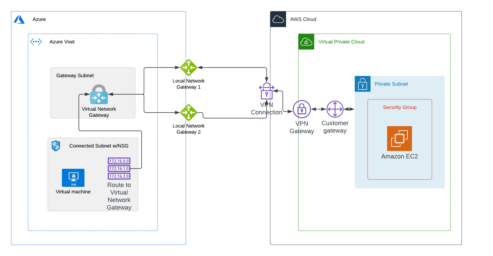

# AWS Azure S2S VPN
> Example terraform configuration for establishing a site to site VPN between AWS and Azure



## Overview
---
The terraform configurations will establish a site to site VPN between AWS and Azure

- `aws-vpc.tf` : Resources for AWS side of the configuration

- `azure-vnet.tf` : Resources for the Azure side of the configuration


## Setup 
---
- `terraform.tfvars` : The following variables are needed for this terraform configuration.
> `example-terraform.tfvars` has been added as an example placeholder
```
aws_access_key = "AWS_ACCESS_KEY"
aws_secret_key = "AWS_SECRET_KEY"
azure_client_id = "AZURE_CLIENT_ID"
azure_client_secret ="AZURE_CLIENT_SECRET"
azure_subscription_id = "AZURE_SUBSCRIPTION_ID"
tenant_id = "AZURE_TENANT_ID"
```

- Authentication/Providers
> AWS is authenticated using access keys and Azure is using a service principle with client id and secret
```
# initialize connection to aws
provider "aws" {
    access_key = var.aws_access_key
    secret_key = var.aws_secret_key
    region = var.region
}
```

```
# initialize connection to azure
provider "azurerm" {
    features {}
    client_id = var.azure_client_id
    client_secret = var.azure_client_secret
    tenant_id = var.tenant_id
    subscription_id = var.azure_subscription_id
}
```

## Execution
---
- Initialize Terraform and load the required providers
```
terraform init
```

- Export the resource creation plan
```
terraform plan -out s2s.tfplan
```
- Apply the configuration outlined in plan
```
terraform apply s2s.tfplan
```

## References
---
- https://medium.com/swlh/hybrid-cloud-with-azure-and-aws-site-to-site-vpn-c4b93e9e4c2e
- https://techcommunity.microsoft.com/t5/fasttrack-for-azure/how-to-create-a-vpn-between-azure-and-aws-using-only-managed/ba-p/2281900